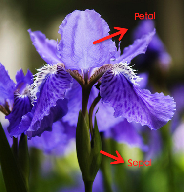

```{r setup, include=FALSE}
knitr::opts_chunk$set(echo = TRUE, warning=FALSE, message=FALSE)
```

# 前言
Kaggle数据挖掘竞赛里有一个经典的探索性分析例子，对iris数据集进行了各种形式的可视化，帮助人通过直观的图形更深地理解特征与label的关系。Kaggle官网给出了Python版本的实现，链接如下：

> https://www.kaggle.com/benhamner/d/uciml/iris/python-data-visualizations/notebook

本文用R对该notebook的代码进行重现，主要使用Hadley大神的ggplot2包。此包是R语言的顶梁柱，多少人拥抱python后，在画图时仍然挂念着ggplot2的好。数据集iris是非常著名的，中文名是鸢尾花，有四个属性，分别是Sepal.Length（花萼长度），Sepal.Width（花萼宽度），Petal.Length（花瓣长度），Petal.Width（花瓣宽度）。网上找了一个图片，做个标注，方便朋友理解。




# 代码

``` {r}
library(tidyr)
library(dplyr)
library(ggplot2)
library(grid)
library(GGally)

# Let's see what's in the iris data
head(iris)

# Let's see how many examples we have of each species
summary(iris$Species)

# Make scatter plot of Sepal.Length and Sepal.Width
p.scatter <- ggplot(iris) + geom_point(aes(x=Sepal.Length, y=Sepal.Width))
p.scatter
```


``` {r}
# Show bivariate scatter plot and univariate histogram
vplayout <- function(x, y) viewport(layout.pos.row = x, layout.pos.col = y)
p.hist.len <- ggplot(iris) + geom_histogram(aes(x=Sepal.Length))
p.hist.wid <- ggplot(iris) + geom_histogram(aes(x=Sepal.Width)) + coord_flip()
grid.newpage()
pushViewport(viewport(layout = grid.layout(3, 3)))
print(p.scatter, vp=viewport(layout.pos.row=2:3, layout.pos.col=1:2))
print(p.hist.len, vp=viewport(layout.pos.row=1, layout.pos.col=1:2))
print(p.hist.wid, vp=viewport(layout.pos.row=2:3, layout.pos.col=3))
```


``` {r}
# One piece of information missing in the plots above is what species each plant is
p.scatter <- ggplot(iris) + geom_point(aes(x=Sepal.Length, y=Sepal.Width, color=Species))
p.scatter
```


``` {r}
# Boxplot to explore numeric variable
p.box <- ggplot(iris) + geom_boxplot(aes(x=Species, y=Petal.Length))
p.box

# One way we can extend this plot is adding a layer of individual points on top of it
p.box.jitter <- p.box + geom_jitter(aes(x=Species, y=Petal.Length))
p.box.jitter
```


``` {r}
# A violin plot combines the benefits of the previous two plots and simplifies them
# Denser regions of the data are fatter, and sparser thiner in a violin plot
p.violin <- ggplot(iris) + geom_violin(aes(x=Species, y=Petal.Length))
p.violin
```


``` {r}
# A final plot useful for looking at univariate relations is the kdeplot,
p.density <- ggplot(iris) + geom_density(aes(x=Petal.Length, colour=Species)) 
p.density
```


``` {r}
# Another useful seaborn plot is the pairplot, which shows the bivariate relation
# between each pair of features
# 
# From the pairplot, we'll see that the Iris-setosa species is separataed from the other
# two across all feature combinations

ggpairs(iris, aes(colour=Species), alpha=0.4) # R could be better!!
```


``` {r}
# Now that we've covered seaborn, let's go back to some of the ones we can make with Pandas
# We can quickly make a boxplot with Pandas on each feature split out by species
p.box.facet <- ggplot(iris %>% gather(feature_name, feature_value, one_of(c("Sepal.Length", "Sepal.Width", "Petal.Length", "Petal.Width")))) + geom_boxplot(aes(x=Species, y=feature_value)) + facet_wrap(~feature_name)
p.box.facet
```


``` {r}
# Parallel coordinate graph & Andrews Curve
# 修改自：http://cos.name/2009/03/parallel-coordinates-and-andrews-curve/
# 轮廓图的思想非常简单、直观，它是在横坐标上取n个点，依次表示各个指标(即变量)；横坐标上则对应各个指标的值(或者经过标准化变换后的值)，然后将每一组数据对应的点依次连接即可
# 调和曲线图的思想和傅立叶变换十分相似：
# 根据三角变换方法将 n 维空间的点映射到二维平面上的曲线上，其中x取值范围为[-pi,pi]。

# Another multivariate visualization technique pandas has is parallel_coordinates
# Parallel coordinates plots each feature on a separate column & then draws lines
# connecting the features for each data sample

p.paral <- ggplot(cbind(iris %>% gather(feature_name, feature_value, one_of(c("Sepal.Length", "Sepal.Width", "Petal.Length", "Petal.Width"))), id=1:nrow(iris))) + geom_line(aes(x=feature_name, y=feature_value, group=id, colour=Species))
p.paral
```


``` {r}
# One cool more sophisticated technique pandas has available is called Andrews Curves
# Andrews Curves involve using attributes of samples as coefficients for Fourier series
# and then plotting these
andrews_curve <- function(data, x_col, y_col, step=pi/30){
  x = as.matrix(data[, x_col])
  t = seq(-pi, pi, pi/30)
  m = nrow(x)
  n = ncol(x)
  f = matrix(0, m, length(t))
  for(i in 1:m) {
    f[i,] = x[i,1]/sqrt(2)
    for(j in 2:n) {
      if (j%%2 == 0)
        f[i, ] = f[i, ] + x[i, j] * sin(j/2 * t)
      else f[i, ] = f[i, ] + x[i, j] * cos(j%/%2 * t)
    }
  }
  colnames(f) <- t
  label <- data[, y_col]
  id <- c(1:nrow(f))
  res <- cbind(as.data.frame(f), label, id)  %>%
    gather(x, y, -label, -id, convert = TRUE)
}

iris.andrew <- andrews_curve(iris, x_col=c("Sepal.Length", "Sepal.Width", "Petal.Length", "Petal.Width"), y_col="Species")
p.andrew <- ggplot(iris.andrew) + geom_line(aes(x, y, group=id, color=label))
p.andrew
```


``` {r}
# A final multivariate visualization technique pandas has is radviz
# Which puts each feature as a point on a 2D plane, and then simulates
# having each sample attached to those points through a spring weighted
# by the relative value for that feature

# 暂时没能力实现

```


