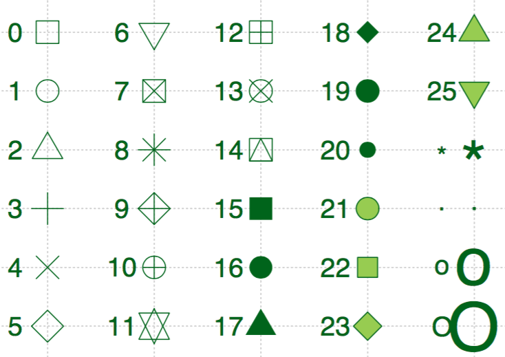

```{r setup, include=FALSE}
knitr::opts_chunk$set(echo = TRUE, warning=FALSE, message=FALSE, cache=TRUE)
```

## 前言
**ggplot2**包是R语言最流行的第三方扩展包，是RStudio首席科学家Hadley Wickham读博期间的作品。包名中“gg”是grammar of graphics的简称，是一套优雅的绘图语法。Wickham Hadley将这套语法诠释如下：

> 一张统计图形就是从**数据**到**几何对象**（geometric object，缩写geom）的**图形属性**（aesthetic attribute，缩写aes）的一个映射。此外，图形中还可能包含数据的**统计变换**（statistical transformation，缩写stats），最后绘制在某个特定的**坐标系**（coordinate system，缩写coord）中，而**分面**（facet）则可以用来生成数据不同子集的图形。


本文将根据这个诠释逐步剖析ggplot2绘图系统。

## 数据
ggplot2接受的输入数据一般是`data.frame`，这是一个表格型结构，每一行是一个观测（observation），每一列是一个变量（variable）。R语言内置了许多著名的数据集，本文选取其中的iris进行讲解。iris中文名是鸢尾花，有四个属性，分别是Sepal.Length（花萼长度），Sepal.Width（花萼宽度），Petal.Length（花瓣长度），Petal.Width（花瓣宽度），以及一个类别标签Species。我在网上找了一个图片，做个标注，方便朋友理解。


我们可以使用`str()`查看数据集的结构，用`summary()`对每一个变量进行统计。

``` {r}
str(iris)
summary(iris)
```

Hadley对`data.frame`提出了一个是否**tidy**的概念，抽象来讲就是一个变量必须有自己独立的一列，一个观测必须有自己独立的一行，每个取值必须有自己独立的一个单元格。为了便于理解，我们从[R for Data Science](http://r4ds.had.co.nz/tidy-data.html)这本书截取出这个图进行解释：


左边的数据是tidy的，右边的数据是不tidy的，通过另一个包**tidyr**可以轻松完成二者的转换。ggplot2的数据要求是tidy的。

## 几何对象、图形属性、图层
### 几何对象
几何对象，说的直观一些，就是你要画什么图来表示这组数据。ggplot2提供了众多几何对象`geom_xyz()`供大家选择。举两个常见的例子，`geom_point()`用于表示两个连续变量之间的关系，几何形状是点；`geom_bar()`用于表示x轴为离散变量，y轴为连续连续变量之间的关系，几何形状是条块。完整的几何对象请下载RStudio公司总结的[ggplot2 cheetsheet](files/ggplot2-cheatsheet.pdf)。

几何对象有一个`position`选项，用于指定如何在空间内布置相同取值的集合对象。`dodge`为并排模式；`fill`为堆叠模式，并归一化为相同的高度；`stack`为纯粹的堆叠模式；`jitter`会在X和Y两个方向增加随机的扰动来防止对象之间的覆盖。

### 图形属性
每个几何对象都有自己的属性，这些属性的取值需要通过数据提供。数据与图形属性之间的映射关系称为**mapping**，在ggplot2中用`aes()`进行定义。常见的图形属性有：`x`，`y`，`size`，`color`，`group`。图形属性的任意一项都可以用数据的某一个变量来表示。

### 图层
ggplot2的绘图过程有点像Photoshop，有一个图层的理念，每个图层可以有自己的图形对象和图形属性，通过`+`将不同图层叠加起来生成最后的统计图形。如果将数据定义在`ggplot()`中，那么所有图层都可以共用这个数据；如果将数据定义在`geom_xyz()`中，那么这个数据就只供这个几何对象使用。

掌握了数据、几何对象、图形属性和图层的概念后，我们就可以开始绘制常见的统计图形了。

### 基本绘图
Kaggle数据挖掘竞赛里有一个经典的探索性分析例子，对iris数据集进行了各种形式的可视化，帮助人通过直观的图形更深地理解特征与label的关系。Kaggle官网给出了[Python版本的实现](https://www.kaggle.com/benhamner/d/uciml/iris/python-data-visualizations/notebook)。本节用R对该notebook的代码进行重现。

``` {r}
library(ggplot2)

# Make scatter plot of Sepal.Length and Sepal.Width
p.scatter <- ggplot(iris) + geom_point(aes(x=Sepal.Length, y=Sepal.Width))
p.scatter

# One piece of information missing in the plots above is what species each plant is
p.scatter <- ggplot(iris) + geom_point(aes(x=Sepal.Length, y=Sepal.Width, color=Species))
p.scatter

# Boxplot to explore numeric variable
p.box <- ggplot(iris) + geom_boxplot(aes(x=Species, y=Petal.Length))
p.box

# One way we can extend this plot is adding a layer of individual points on top of it
p.box.jitter <- p.box + geom_jitter(aes(x=Species, y=Petal.Length))
p.box.jitter

# A violin plot combines the benefits of the previous two plots and simplifies them
# Denser regions of the data are fatter, and sparser thiner in a violin plot
p.violin <- ggplot(iris) + geom_violin(aes(x=Species, y=Petal.Length))
p.violin

# A final plot useful for looking at univariate relations is the kdeplot,
p.density <- ggplot(iris) + geom_density(aes(x=Petal.Length, colour=Species)) 
p.density
```

## 分面与布局
分面，就是分组绘图，根据定义的规则，将数据分为多个子集，每个子集按照统一的规则单独制图，排布在一个页面上。ggplot2提供两种分面模式：`facet_grid()`和`facet_wrap()`。

我们先来看一下`facet_grid()`的效果。

```{r}
library(tidyr)
library(dplyr)
# 将数据变为tidy的
tidy_iris <- iris %>% 
  gather(feature_name, feature_value, one_of(c("Sepal.Length", "Sepal.Width", "Petal.Length", "Petal.Width")))

p.box.facet <- ggplot(tidy_iris) + geom_boxplot(aes(x=Species, y=feature_value)) + facet_grid(feature_name~Species)
p.box.facet
```

可以看到`facet_grid()`是一个二维的矩形布局，每个子集的位置由`行位置变量~列位置变量`的决定，在上面的例子中就是每一个Species的取值作为一行，每一个feature_name的取值作为一列。

再来看一下`facet_wrap()`的效果。

```{r}
p.box.facet <- ggplot(tidy_iris) + geom_boxplot(aes(x=Species, y=feature_value)) + facet_wrap(~feature_name+Species, scales="free")
p.box.facet
```

`facet_wrap()`生成一个动态调整的一维布局，根据`~位置变量1+位置变量2+...`来确定每个子集的位置，先逐行排列，放不下了移动到下一行。`scales="free"`让每个子图的坐标系适合自己的数据，便于在有限的空间里充分展示子图的细节，但也失去了不同子图之间比较的作用，需要谨慎使用。

分面的特点是可以快速生成多个子图，每个子图的生成方式是一样的，因此只需要指定分组的规则即可。但是有时候我们希望绘制多个子图，每个子图的生成方法却不一样，这个时候分面就不起作用了，需要使用**grid**包提供的布局功能。下面我们用ggplot2和grid的布局实现一个较为复杂的统计图形效果：

``` {r}
library(grid)
# Show bivariate scatter plot and univariate histogram
p.hist.len <- ggplot(iris) + geom_histogram(aes(x=Sepal.Length))
p.hist.wid <- ggplot(iris) + geom_histogram(aes(x=Sepal.Width)) + coord_flip()
grid.newpage()
pushViewport(viewport(layout = grid.layout(3, 3)))
print(p.scatter, vp=viewport(layout.pos.row=2:3, layout.pos.col=1:2))
print(p.hist.len, vp=viewport(layout.pos.row=1, layout.pos.col=1:2))
print(p.hist.wid, vp=viewport(layout.pos.row=2:3, layout.pos.col=3))
```


在做数据分析时，我们经常需要观察变量自身与变量之间的两两关系。这个过程中需要绘制大量的图表，且每个业务的数据分析都需要这么做，因此算是一种重复性比较大的工作。我们可以使用**GGally**包来快速完成这个探索性分析的任务。


``` {r}
library(GGally)
# Another useful seaborn plot is the pairplot, which shows the bivariate relation
# between each pair of features
# 
# From the pairplot, we'll see that the Iris-setosa species is separataed from the other
# two across all feature combinations

ggpairs(iris, aes(colour=Species), alpha=0.4) # R could be better!!
```

Kaggle数据挖掘竞赛剩下的例子是绘制Parallel coordinate graph、Andrews Curve、radviz，前两个的实现参考如下，最后一个暂时没找到对应的方法。

``` {r}
# Parallel coordinate graph & Andrews Curve
# 修改自：http://cos.name/2009/03/parallel-coordinates-and-andrews-curve/
# 轮廓图的思想非常简单、直观，它是在横坐标上取n个点，依次表示各个指标(即变量)；横坐标上则对应各个指标的值(或者经过标准化变换后的值)，然后将每一组数据对应的点依次连接即可
# 调和曲线图的思想和傅立叶变换十分相似：
# 根据三角变换方法将 n 维空间的点映射到二维平面上的曲线上，其中x取值范围为[-pi,pi]。

# Another multivariate visualization technique pandas has is parallel_coordinates
# Parallel coordinates plots each feature on a separate column & then draws lines
# connecting the features for each data sample

p.paral <- ggplot(cbind(iris %>% gather(feature_name, feature_value, one_of(c("Sepal.Length", "Sepal.Width", "Petal.Length", "Petal.Width"))), id=1:nrow(iris))) + geom_line(aes(x=feature_name, y=feature_value, group=id, colour=Species))
p.paral
```


``` {r}
# One cool more sophisticated technique pandas has available is called Andrews Curves
# Andrews Curves involve using attributes of samples as coefficients for Fourier series
# and then plotting these
andrews_curve <- function(data, x_col, y_col, step=pi/30){
  x = as.matrix(data[, x_col])
  t = seq(-pi, pi, pi/30)
  m = nrow(x)
  n = ncol(x)
  f = matrix(0, m, length(t))
  for(i in 1:m) {
    f[i,] = x[i,1]/sqrt(2)
    for(j in 2:n) {
      if (j%%2 == 0)
        f[i, ] = f[i, ] + x[i, j] * sin(j/2 * t)
      else f[i, ] = f[i, ] + x[i, j] * cos(j%/%2 * t)
    }
  }
  colnames(f) <- t
  label <- data[, y_col]
  id <- c(1:nrow(f))
  res <- cbind(as.data.frame(f), label, id)  %>%
    gather(x, y, -label, -id, convert = TRUE)
}

iris.andrew <- andrews_curve(iris, x_col=c("Sepal.Length", "Sepal.Width", "Petal.Length", "Petal.Width"), y_col="Species")
p.andrew <- ggplot(iris.andrew) + geom_line(aes(x, y, group=id, color=label))
p.andrew
```


``` {r}
# A final multivariate visualization technique pandas has is radviz
# Which puts each feature as a point on a 2D plane, and then simulates
# having each sample attached to those points through a spring weighted
# by the relative value for that feature

# 暂时没能力实现

```

## 标尺
前面提到`aes()`设定了数据与图形属性的映射关系，但是数据怎么映射为属性，这就是标尺（Scales）的功能。对于任何一个图形属性，如`x`，`y`，`alpha`，`color`，`fill`，`linetype`，`shape`，`size`，ggplot2都提供以下四种标尺：

- `scale_*_continuous()`：将数据的连续取值映射为图形属性的取值
- `scale_*_discrete()`：将数据的离散取值映射为图形属性的取值
- `scale_*_identity()`：使用数据的值作为图形属性的取值
- `scale_*_mannual()`：将数据的离散取值作为手工指定的图形属性的取值

举个例子

``` {r}
group_iris <- iris %>% group_by(Species) %>% dplyr::summarise(avg_sepal_length=mean(Sepal.Length))
str(group_iris)
p <- ggplot(group_iris) + geom_bar(aes(x=Species, weight=avg_sepal_length, fill=Species))
p
p + scale_fill_manual(
  values = c("skyblue", "royalblue", "navy"), # mannual类scale特有的选项，指定图形属性的取值范围
  limits = c("setosa", "versicolor", "virginica"), # 数据的取值范围
  breaks = c("setosa", "versicolor", "virginica"), # 图例和轴要显示的分段点
  name = "Species",  # 图例和轴使用的名称
  labels = c("set", "ver", "vir")  # 图例使用的标签
)
```

除了上述四大类通用的标尺，特定的图形属性还有一些专门的标尺类型。对于`x`和`y`类图形属性，有如下几种特殊的标尺：

- `scale_x_date(labels=date_format("%m/%d"), breaks=date_breaks("2 weeks"))`
- `scale_x_datetime()`
- `scale_x_log10()`
- `scale_x_reverse()`
- `scale_x_sqrt()`

对于`color`和`fill`类的图形属性，有如下几类特殊标尺：

- `scale_fill_brewer(palette="Blues")`：根据调色盘生成颜色标尺，可用的调色盘可以通过`RColorBrewer::display.brewer.all()`命令查看；对于具体的一个调色盘，可以通过`RColorBrewer::brewer.pal(n=4, name="Blues")`查看具体某个名字调色盘的`n`个配色值。
- `scale_fill_grey(start=0.2, end=0.8, na.value="red")：灰度标尺
- `scale_fill_gradient(low="red", high="yellow")`：双色渐变标尺
- `scale_fill_gradient2(low="red", high="blue", mid="white", midpoint=25)`：三色渐变标尺
- `scale_fill_gradientn(colours=terrain.colors(6))`：n色渐标尺，其他的调色盘有`rainbow()`，`heat.colors()`，`topo.colors()`，`cm.colors()`以及**RColorBrewer**包的调色盘。

对于`shape`类的图形属性，我们可以手工指定形状：`scale_shape_manual(values=c(3:7)`。每个形状用数字表示，根据下图可以选择自己需要的形状。



## 坐标系
ggplot2默认的坐标系是笛卡尔坐标系，可以用如下方法指定取值范围：`coord_cartesian(xlim=c(0,5), ylim=c(0,3))`。如果想要让x轴和y轴换位置，比如将柱形图换成条形图，可以使用`coord_flip()`函数。`coord_polar(theta="x", direction=1)`是角度坐标系,theta指定角度对应的变量，start指定起点离12点钟方向的偏离值，direction若为1表示顺时针方向，若为-1表示逆时针方向。

## 主题
所有与数据不相关的图形控制细节都放在`theme()`这个函数里。ggplot2内置了一些常见的主题：`theme_bw()`，`theme_classic()`，`theme_grey()`，`theme_minimal()`。如果需要更多的主题可以安装`ggthemes`包，也可以自定义主题。

## 图例
ggplot2可以设定图例的位置：`theme(legend.position="bottom")`，其他选项有top、left和right。

每个图形属性都会有一个图例，图例的类型共有三种：colorbar为颜色条，适合连续变量；legend为键值对，适合有限取值的变量；none，将一个图形属性的图例设置为none，则不显示这个图形属性的图例。


## 标签
常用的绘图标签有：

- `ggtitle("New Plot Title")`：指定图形名称
- `xlab("New X label")`：指定x轴标签
- `ylab("New Y label")`：指定y轴标签
- 图例标签需要使用`scale_*()`的`name`和`labels`选项进行指定


