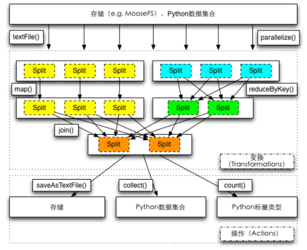

# Spark RDD概念及Spark与Hadoop的区别

RDD是Spark的核心。关于它的定义，简单来说，就是能够保存在内存里的分布式数据集。官方定义如下：

> The main abstraction Spark provides is a **resilient distributed dataset (RDD)**, which is a collection of elements partitioned across the nodes of the cluster that can be operated on in parallel.    
出处：*Spark Programming Guide*


对于Hadoop而言，分布式数据集是存储在文件系统HDFS上的，这样的坏处：数据处理往往需要多个MapReduce环节，下一个环节很可能依赖于上一个环节的输出；由于没有分布式内存机制，Hadoop必须把上一个环节MapReduce的输出结果写到硬盘HDFS上，下一个环节再从HDFS上读取。因此磁盘IO将会花费大量的时间。这种模式对于迭代式计算，如机器学习，非常不便。

Spark创造的RDD机制可以很好地解决这个问题。一般而言，Spark的流程如下：首先，从HDFS读取数据创建RDD；然后对RDD进行各种数据转换与处理的操作（可以简单理解为若干个Hadoop的MapReduce操作），直到得到满意的结果；最后，将结果写到HDFS，或者输出至屏幕。

如果把Spark的这个过程和Hadoop作对比，最大的区别就是用RDD替代了HDFS作为不同数据处理环节的媒介；当然，还有一个重要的区别，Hadoop只提供了Map和Reduce两种操作，Spark提供了更加灵活的操作方法，后面会有更详细的阐述。


# Spark WordCount代码解析
``` python
from pyspark import SparkContext
sc = SparkContext("local", "wordcount")
textFile = sc.textFile("YOUR_SPARK_HOME/README.md")
wordCounts = textFile.flatMap(lambda line: line.split()).map(lambda word: (word, 1)).reduceByKey(lambda a, b: a+b)
print wordCounts.collect()
```

请阅读上述代码，解读SparkContext、textFile、flatMap、map、reduceByKey、collect，指出哪些是transformation，哪些是action，并描述**transformation**和**action**的区别。
**参考答案**

代码剖析如下：

1. 导入Python使用的Spark包
2. 初始化Spark环境，"local"表示程序用单机模拟Spark，"wordcount"是Spark程序的名字，这个名字会显示在Spark的集群管理页面
3. **textFile()**用于从文件系统读取数据，生成RDD
4. **flatMap()**将RDD的每一行按照参数定义的函数转化为多行，*lambda*定义了Python的匿名函数，函数输入是line，输出是line.split()；**map()**将RDD的每一行按照参数定义的函数转化为一行，(word, 1)表示一个键值对，word为key，1为value；**reduceByKey()**将RDD按照key分组后，按照参数定义的函数进行合并，此处函数的作用是是分组求和
5. **collect()**，将RDD的数据，从集群的各个节点收集回提交任务的机器

transformation输入是RDD，输出是RDD；action输入是RDD，输出不是RDD。以上操作collect为action，其余为transformation。RDD的操作不会立刻执行，只有碰到action才会触发任务。

# 常用的RDD操作汇总


# 宽依赖 VS 窄依赖
TBD

# 资源配置参数解读

``` shell
#!/bin/sh
export JAVA_HOME=$YOUR-JAVA-DIR/jdk1.7.0_67
SPARK_HOME=$YOUR-SPARK-DIR/spark-1.5.1-bin-hadoop2.3

MASTER=spark://XXX:7077,YYY:7077
#MASTER=local[*]

mode=client
#mode=cluster

port=5081

driver_mem="3g"

executor_mem="4g"
executor_cores=2
total_executor_cores=24

cur_dir=$(cd `dirname $0`;pwd)

command="$SPARK_HOME/bin/spark-submit \
    --master $MASTER \
    --deploy-mode $mode \
    --driver-memory $driver_mem \
    --total-executor-cores $total_executor_cores  \
    --executor-cores $executor_cores  \
    --executor-memory $executor_mem \
    --py-files $cur_dir/read_conf.py,$cur_dir/logger.py \
    --conf spark.ui.port=$port \
    --conf spark.driver.maxResultSize=2g \
    --conf spark.file.transferTo=false \
    --conf spark.eventLog.enabled=true \
    --conf spark.eventLog.dir=hdfs://xx.xxx.xxx.xx:5000/user/xxxx/spark \
    word_count.py \
    $*"

echo $command
$command
```

已知集群配置情况如下：4台机器，每台机器8个核，每台机器32G内存。请问上述Spark应用有多少个executor，每个executor占用多少CPU和内存？driver的client mode和cluster mode有什么区别？

**参考答案**

application提交后，一共会占据24个核（即每台机器6个核）；每个executor占用2个核，因此每台机器启动3个executor；每个executor占用4G内存，因此每台机器占用12G内存。

client mode下driver运行在本地机器；cluster mode下driver运行在Spark集群中，driver的资源开销都会算到集群上。

# 并发调试原理

RDD的action操作会触发一个Job。Spark的job根据宽窄依赖会被拆分为若干个stage，每个stage包含了若干个task，task内部是串行处理数据，因此task的个数是决定程序性能的最重要参数。

task的个数与stage中上一个RDD的partition个数相同。而一个RDD的partition个数与被它依赖的RDD的partition个数相同。如果一个RDD没有父RDD，比如从textFile得到，那么一般情况是一个HDFS block生成一个partition，默认是256M一个partition。如果通过parallelize，有个参数进行partition的设定。

要知道partition的个数，可以通过接口rdd.partitions().size()获得。

过少的task个数会导致聚集操作时，每个task的内存压力很大，因为过少的task意味着过少的partition，所以意味着过大的数据量。类似join的操作会在内存生成hash-map用于分组或者排序，如果这个task对应的数据不能轻易塞进内存中，一方面会导致GC压力，另一方面会引发数据落盘，带来磁盘IO。

如何增加partition个数？如果是从HDFS读取的数据，可以使用repartition，或者缩小HDFS block的size，或者修改InputFormat。

如果是从其他stage引入获得的partition，在引发stage边界的操作会接受一个numPartitions的参数，通过实验的方法来确定它的最优值，不停地将partition的个数从上次实验的partition个数乘以1.5，直到性能不再提升位置。

# 资源配置与并发调试经验总结

首先确定内存。Spark使用两种类型的内存，一是数据缓存，二是计算。数据缓存就是用户调用cache()方法存储在内存中的数据，一般占比50%。计算分为两类，一类是用户定义的计算，另一类是spark自行的shuffle计算，经验上来讲分别占比约为30%和20%。

确定数据cahce内存的最好方法是创建RDD并缓存，然后去Spark Application网页界面的Storage查看：The best way to size the amount of memory consumption a dataset will require is to create an RDD, put it into cache, and look at the “Storage” page in the web UI. The page will tell you how much memory the RDD is occupying.

RDD Cache的内存占用量乘以2得到需要申请的内存总数。每个CPU处理5G内存，于是可以得到CPU核数。每个CPU处理2-3个task。task数取决于partition数。

# Spark Streaming原理
[腾讯-广点通教程](https://github.com/lw-lin/CoolplaySpark/tree/master/Spark%20Streaming%20%E6%BA%90%E7%A0%81%E8%A7%A3%E6%9E%90%E7%B3%BB%E5%88%97)

