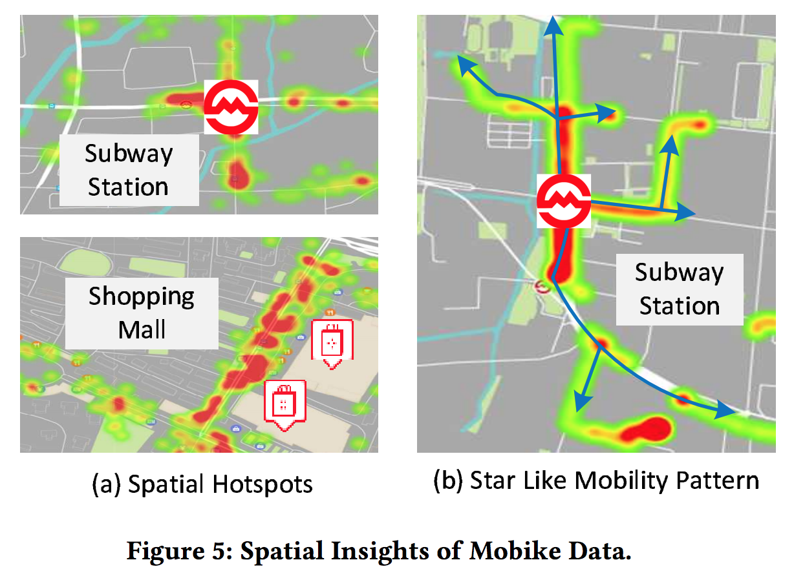
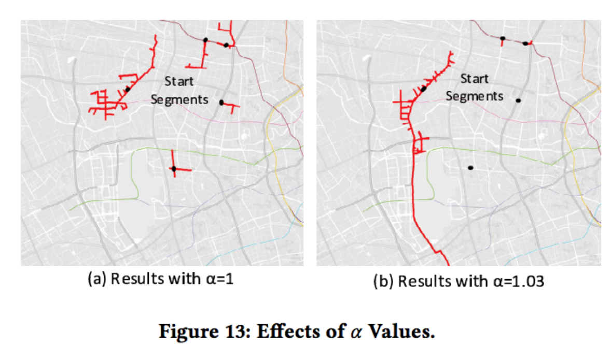
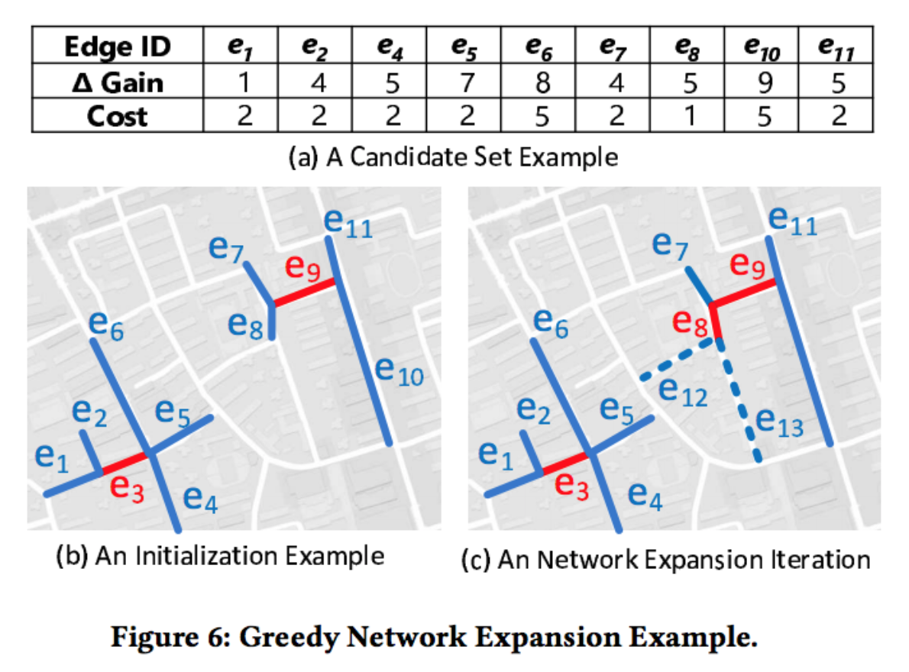

下载原始论文请点击[这里](https://www.microsoft.com/en-us/research/wp-content/uploads/2017/06/main-1.pdf)

## 总体框架

- 输入数据：自行车轨迹 + 路网
- Pre-processing：主要包括轨迹点去噪和地图匹配，以及根据道路ID获取相应轨迹的空间索引机制
- Bike-lane planning：文章的核心部分，基于数据观察的结果，提出了一种贪婪的路网扩散算法，以及该算法依赖的初始化算法

## 自行车轨迹的特点

- Spatial hot spots：取出摩拜单车轨迹的起点，绘制热力图，可以发现，最热的点往往是地铁站（左上）或大型商场（左下）
- Star like mobility pattern：根据摩拜单车的行驶轨迹，可以发现大家的出行模式都是从起点开始逐步往外扩散，类似星型（右图）

考虑到hot spots，文章选取了top k热的路段作为算法的初始状态；考虑到star like mobility pattern，文章使用top k的相邻路段不断往外扩展生成自行车道规划结果。

## 初始化算法

直接选取最热的k个路段作为初始路段的效果不好，因为这k个路段之间往往会连在一块。对于连在一块的路段集合，我们希望只取其中一个路段来做代表。因此，我们需要使用聚类算法。

文章使用的聚类算法流程如下：首先，选出top 1%的路段作为备选，这是为了削减聚类算法的输入数据量，提高算法效率；然后，使用hierarchical-based clustering method（agglomeration hierarchical clustering method）。选择这个聚类算法的原因是：不需要像DBSCAN那样需要精心调整参数才能获取较好的聚类效果；不像kmeans那样获取的结果不稳定。

## 收益函数

我们使用轨迹对自行车道的规划方案打分。对于一条自行车轨迹，自行车道覆盖的长度越长对用户来讲体验越好。但是，当两种规划方案覆盖的轨迹长度相同时，哪一种好呢？我们认为能够连续行驶的规划方案更好。因此，上图中Plan 2比Plan 1好。

假设轨迹被规划方案覆盖的部分被分为了n段。上图Plan 1把轨迹分为两段，分别是$s_1=1km$和$s_2=1km$；Plan 2把轨迹分为1段，是$s_1=2km$。Plan 2的得分应该比Plan 1要高，为了达到这个效果，我们使用下面的公式计算得分：

$$score_i=\sum_{s_j \in S_i} \alpha ^{s_j} s_j, \alpha > 1$$

对于一个路段集合，把每条轨迹的分数加起来作为这个集合的得分。

我们可以看一下$\alpha$取值的影响效果：

## 路网扩散方法

初始化的路段选定以后，我们也获得了相应的邻接路段集合。对每个路段集合，我们评价将其加入后的得分，将得分除以该路段的建设成本得到ratio，将ratio最大的加入集合，如此反复，直到建设成本超出预算。

## 关于摩拜的轨迹数据

- a) 70%在2km以下
- b) 绝大多数不到30分钟
- c) 早高峰、晚高峰明显，凌晨依然有使用量
- d) 不详

摩拜单车的时空分布很有意思，如下图：

