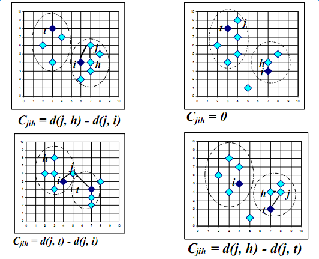

```{r setup, include=FALSE}
knitr::opts_chunk$set(echo = TRUE, cache=TRUE, warning=F, message=F)
```


聚类算法用于根据数据的特征发现数据项的相似性，并将相似的数据项放在同一个组中，相似性采用距离进行描述。

## K-means聚类

简单的说，一般流程如下：先随机选取k个点，将每个点分配给它们，得到最初的k个分类；在每个分类中计算均值，将点重新分配，划归到最近的中心点；重复上述步骤直到点的划归不再改变。下图是K-means方法的示意。


K-means聚类算法的问题是，均值的计算受异常点的干扰比较严重。为了克服这个问题，可以采用K中值法。

## K-medoid聚类
PAM（Partition Around Medoids）是K-medoid的基础算法，基本流程如下：首先随机选择k个对象作为中心，把每个对象分配给离它最近的中心。然后随机地选择一个非中心对象替换中心对象，计算分配后的距离改进量。聚类的过程就是不断迭代，进行中心对象和非中心对象的反复替换过程，直到目标函数不再有改进为止。非中心点和中心点替换的具体类别如下图分析（用h替换i相对j的开销）。
   


PAM算法的问题在于伸缩性不好，需要测试所有的替换，只适用于小数据量的聚类。

为了提高该算法的可伸缩性，有人提出了CLARAN算法，本质如下：从总体数据中生成多个样本数据，在每个样本数据上应用PAM算法得到一组K中值点；取出所有样本中结果最好的那一组作为最后的解。CLARAN算法存在的问题是，算法的聚类质量依赖于样本的质量。

为了提高PAM和CLARAN算法的聚类质量，有人在CLARAN算法的基础上提出了CLARANS算法。与CLARAN相比，最大的区别在于没有一个时刻算法局限于固定的一个样本中，自始自终，算法的样本数据都是随机抽样的。其算法过程如下。将每套k个中值点作为一个节点，若两个节点之间有k-1个点相同，则成为邻居。用户事先指定两个数，一是最大的邻居数，二是最大的局部最优点数。算法随机选取一个当前点，随机地取出其中的一个邻居，看目标值是否有改进，如果有改进，则用邻居替代当前点，重新开始搜索邻居的过程；若抽取了最大邻居数的邻居，发现当前点最优，那么就找到了一个局部最优点。找到一个局部最优点后，再随机抽取一个当前点，进行上面的过程，直到找到了用户指定最大数量的局部最优点。比较每个局部最优点的目标值，取最优的那个点作为结果，即可得到k个中值点，于是k个类就可以轻松得到。CLARANS算法的效果不错，但算法复杂度更高。

## 实践
### python
使用**scikit-learn**可以完成相应功能。

```{python, eval=F}
#!/bin/bash
# -*- coding: utf-8 -*-
import time
import numpy as np
import matplotlib.pyplot as plt

from sklearn.cluster import MiniBatchKMeans, KMeans
from sklearn.metrics.pairwise import pairwise_distances_argmin
from sklearn.datasets.samples_generator import make_blobs

np.random.seed(0)

batch_size = 45
centers = [[1, 1], [-1, -1], [1, -1]]
n_clusters = len(centers)
X, labels_true = make_blobs(n_samples=3000, centers=centers, cluster_std=0.7) 

k_means = KMeans(init='k-means++', n_clusters=3, n_init=10) # init指定初始化方法，n_clusters指定聚类数，n_init表示重复几次选最好
t0 = time.time()
k_means.fit(X)
t_batch = time.time() - t0

mbk = MiniBatchKMeans(init='k-means++', n_clusters=3, batch_size=batch_size,
                      n_init=10, max_no_improvement=10, verbose=0)
t0 = time.time()
mbk.fit(X)
t_mini_batch = time.time() - t0

fig = plt.figure(figsize=(12, 4))
fig.subplots_adjust(left=0.02, right=0.98, bottom=0.05, top=0.9)
colors = ['#4EACC5', '#FF9C34', '#4E9A06']

# We want to have the same colors for the same cluster from the
# MiniBatchKMeans and the KMeans algorithm. Let's pair the cluster centers per
# closest one.
k_means_cluster_centers = np.sort(k_means.cluster_centers_, axis=0)
mbk_means_cluster_centers = np.sort(mbk.cluster_centers_, axis=0)
k_means_labels = pairwise_distances_argmin(X, k_means_cluster_centers)
mbk_means_labels = pairwise_distances_argmin(X, mbk_means_cluster_centers)
order = pairwise_distances_argmin(k_means_cluster_centers,
                                  mbk_means_cluster_centers)

# KMeans
ax = fig.add_subplot(1, 3, 1)
for k, col in zip(range(n_clusters), colors):
    my_members = k_means_labels == k
    cluster_center = k_means_cluster_centers[k]
    ax.plot(X[my_members, 0], X[my_members, 1], 'w',
            markerfacecolor=col, marker='.')
    ax.plot(cluster_center[0], cluster_center[1], 'o', markerfacecolor=col,
            markeredgecolor='k', markersize=6)
ax.set_title('KMeans')
ax.set_xticks(())
ax.set_yticks(())
plt.text(-3.5, 1.8,  'train time: %.2fs\ninertia: %f' % (
    t_batch, k_means.inertia_))

# MiniBatchKMeans
ax = fig.add_subplot(1, 3, 2)
for k, col in zip(range(n_clusters), colors):
    my_members = mbk_means_labels == order[k]
    cluster_center = mbk_means_cluster_centers[order[k]]
    ax.plot(X[my_members, 0], X[my_members, 1], 'w',
            markerfacecolor=col, marker='.')
    ax.plot(cluster_center[0], cluster_center[1], 'o', markerfacecolor=col,
            markeredgecolor='k', markersize=6)
ax.set_title('MiniBatchKMeans')
ax.set_xticks(())
ax.set_yticks(())
plt.text(-3.5, 1.8, 'train time: %.2fs\ninertia: %f' %
         (t_mini_batch, mbk.inertia_))

# Initialise the different array to all False
different = (mbk_means_labels == 4)
ax = fig.add_subplot(1, 3, 3)

for k in range(n_clusters):
    different += ((k_means_labels == k) != (mbk_means_labels == order[k]))

identic = np.logical_not(different)
ax.plot(X[identic, 0], X[identic, 1], 'w',
        markerfacecolor='#bbbbbb', marker='.')
ax.plot(X[different, 0], X[different, 1], 'w',
        markerfacecolor='m', marker='.')
ax.set_title('Difference')
ax.set_xticks(())
ax.set_yticks(())

plt.show()
```


### R

``` {r}
x <- rbind(matrix(rnorm(100, sd=0.3), ncol=2), 
           matrix(rnorm(100, mean=1, sd=0.3), ncol=2))

colnames(x) <- c("feature1", "feature2")
cl <- kmeans(x, 2)

library(ggplot2)
x_center <- as.data.frame(cbind(1:nrow(cl$centers), cl$centers))
colnames(x_center) <- c("cluster_id", "feature1", "feature2")
x_center$cluster_id <- as.factor(x_center$cluster_id)
x_label <- data.frame(cbind(x, cl$cluster))
colnames(x_label) <- c(colnames(x), "label")
x_label$label <- as.factor(x_label$label)
p <- ggplot() + 
  geom_point(data=x_label, aes(x=feature1, y=feature2, color=label)) +
  geom_point(data=x_center, aes(x=feature1, y=feature2), shape=15, color="black", size=I(3))
print(p)                    
```


### Java
使用**Apache Commons Math**库完成聚类


``` {java, eval=F}
// wrapper class
public static class LocationWrapper implements Clusterable {
    private double[] points;
    private Location location;

    public LocationWrapper(Location location) {
        this.location = location;
        this.points = new double[] { location.getX(), location.getY() }
    }

    public Location getLocation() {
        return location;
    }

    public double[] getPoint() {
        return points;
    }
}

// we have a list of our locations we want to cluster. create a      
List<Location> locations = ...;
List<LocationWrapper> clusterInput = new ArrayList<LocationWrapper>(locations.size());
for (Location location : locations)
    clusterInput.add(new LocationWrapper(location));


// initialize a new clustering algorithm. 
// we use KMeans++ with 10 clusters and 10000 iterations maximum.
// we did not specify a distance measure; the default (euclidean distance) is used.
KMeansPlusPlusClusterer<LocationWrapper> clusterer = new KMeansPlusPlusClusterer<LocationWrapper>(10, 10000);
List<CentroidCluster<LocationWrapper>> clusterResults = clusterer.cluster(clusterInput);

// output the clusters
for (int i=0; i<clusterResults.size(); i++) {
    System.out.println("Cluster " + i);
    for (LocationWrapper locationWrapper : clusterResults.get(i).getPoints())
        System.out.println(locationWrapper.getLocation());
    System.out.println();
}
```
