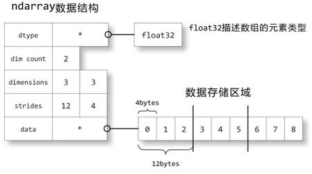

```{r setup, include=FALSE}
knitr::opts_chunk$set(echo = TRUE)
```

# 前言
numpy对python的意义非凡，在数据分析与机器学习领域为python立下了汗马功劳。现在用python搞数据分析或机器学习经常使用的pandas、matplotlib、sklearn等库，都需要基于numpy构建。毫不夸张地说，没有numpy，python今天在数据分析与机器学习领域只能是捉襟见肘。

## 关于数据分析语言
数据分析面向的数据大多数是二维表。一门好的数据分析语言，首先需要能够直接有个数据结构存下这个二维表，然后要配上一套成熟的类SQL的数据操作接口，最后要有一套好用的可视化工具。R语言就是一个极好的典范：用内置的data.frame结构做数据的存储；data.frame本身提供足够强大的数据操作能力，另有dplyr、tidyr、data.table、plyr、reshape2等库提供更好用更高效的数据操作能力；在绘图上，除了基本的plot功能外，还提供了ggplot2这样一套优雅的绘图语言，还通过htmlwidget库与javascript各种绘图库建立了紧密的联系，让可视化的动态展示效果更进一步。Excel也是一个极好的例子，有单元格这种灵活的结构为数据存储做支撑，有大量的函数实现灵活的操作，也有强大的绘图系统。

python目前在数据分析领域也已经具备了相当可观的能力，包括pandas库实现的DataFrame结构，pandas本身提供的数据操作能力，matplotlib提供的数据可视化能力，而这一切都离不开numpy库。

## 关于机器学习语言
一般来讲，一门好的机器学习语言在数据分析上也一定很吃得开，因为数据分析往往是机器学习的基础。但是机器学习的要求更高，因为在模型训练阶段往往需要较为复杂的参数估计运算，因此语言需要具备较强的科学计算能力。科学计算能力，最核心的就是矩阵运算能力。关于矩阵运算能力，[这篇文章](http://sebastianraschka.com/Articles/2014_matrix_cheatsheet.html)对各种语言有很好的比较。

如果没有numpy，python内部只能用list或array来表示矩阵。假如用list来表示[1,2,3]，由于list的元素可以是任何对象，因此list中所保存的是对象的指针，所以需要有3个指针和三个整数对象，比较浪费内存和CPU计算时间。python的array和list不同，它直接保存数值，和C语言的一维数组比较类似，但是不支持多维，表达形式很简陋，写科学计算的算法很难受。numpy弥补了这些不足，其提供的ndarray是存储单一数据类型的多维数组，且采用预编译好的C语言代码，性能上的表现也十分不错。

python最流行的机器学习库sklearn构建在numpy之上，提供了各种标准机器学习模型的训练与预测接口，其中模型训练接口的内部实现是基于numpy库实现的。比如很常见的线性回归模型，参数估计调用的是numpy.linalg.lstsq函数。

# numpy的核心结构：ndarray
> 以下内容摘录自[用Python做科学计算](http://old.sebug.net/paper/books/scipydoc/index.html)

``` {python, eval=F}
a = np.array([[0,1,2],[3,4,5],[6,7,8]], dtype=np.float32)
```

ndarray是numpy的核心数据结构。我们来看一下ndarray如何在内存中储存的：关于数组的描述信息保存在一个数据结构中，这个结构引用两个对象，一块用于保存数据的存储区域和一个用于描述元素类型的dtype对象。




数据存储区域保存着数组中所有元素的二进制数据，dtype对象则知道如何将元素的二进制数据转换为可用的值。数组的维数、大小等信息都保存在ndarray数组对象的数据结构中。

strides中保存的是当每个轴的下标增加1时，数据存储区中的指针所增加的字节数。例如图中的strides为12,4，即第0轴的下标增加1时，数据的地址增加12个字节：即a[1,0]的地址比a[0,0]的地址要高12个字节，正好是3个单精度浮点数的总字节数；第1轴下标增加1时，数据的地址增加4个字节，正好是单精度浮点数的字节数。

> 以下内容总结自Numpy官方文档[Numpy basics](http://docs.scipy.org/doc/numpy/user/quickstart.html)

关于ndarray的索引方式，有以下几个重点需要记住：

* 虽然`x[0,2] = x[0][2]`，但是前者效率比后者高，因为后者在应用第一个索引后需要先创建一个temporary array，然后再应用第二个索引，最后找到目标值。
* 分片操作不会引发copy操作，而是创建原ndarray的view；他们所指向的内存是同一片区域，无论是修改原ndarray还是修改view，都会同时改变二者的值。
* index array和boolean index返回的是copy，不是view。

关于上面列举的**分片操作不会引发copy操作**，我们来进一步探讨一下。先看一下numpy的例子：


``` {python}
import numpy as np
a = np.arange(10)
a.shape = (2,5)
print "input a:", a

b = a[0, ]
print "copy b:", b

b[1] = -1
print "modify b:", b
print "final a:", a 
```


再来看一下R的例子：

```{r}
a <- matrix(0:9, nrow=2, byrow=TRUE)
a

b <- a[1,]
b[2] <- -1
b

a
```


可以看到numpy和R在矩阵的分片操作有不同的设计理念：在R里分片操作会引起数据的复制，在numpy里不会。事实上，R的设计理念很多时候可以用一句话来概括：copy on modify，一旦对数据有修改就会引起内存上的复制操作，这个操作要花不少时间，因此经常会听到人们抱怨R费内存且速度慢。所以，我们可以看到numpy在处理这件事情上明显要用心很多，根据场景设计了不同的策略，不是简单地采用R的一刀切方式。当然，这也带来了一些学习成本，需要对numpy足够熟悉才能避免踩坑。R社区里对copy on modify的哲学也有诟病并在努力改变，比如同是data.frame操作库的data.table和dplyr，data.table性能比dplyr高很多，部分原因也是data.table规避了copy on modify的方式。

# Structured Array
根据numpy的官方文档，定义结构化数组有四种方式。本文采用字典方法，通过定义一个dtype对象实现，需要指定的键值有names和formats。我们用IPython的计时函数看一下提取数据的效率：

``` {python}
import numpy as np
persontype = np.dtype({
        'names': ['name', 'age', 'weight'], 
        'formats': ['S32', 'i', 'f']
    })
a = np.array([("Zhang", 32, 75.5), ("Wang", 24, 65.2)], dtype=persontype)

import time
start = time.clock()
a[1]
end = time.clock()
print "a[1] cost time: %f" % (end-start)

start = time.clock()
a['name']
end = time.clock()
print "a['name'] cost time: %f" % (end-start)

start = time.clock()
a[1]['name']
end = time.clock()
print "a[1]['name'] cost time: %f" % (end-start)

start = time.clock()
a['name'][1]
end = time.clock()
print "a['name'][1] cost time: %f" % (end-start)

```


从上面的结果，我们发现，获取相同的数据有多种操作，不同的操作性能差别很大。我做了一个推测，纯粹是瞎猜：numpy在建立结构化数组时，将整个结构体连续存储在一起，即按行存储，因此`a[1]`的速度最快；但是为了保证提取列的效率，对`a['name']`建立了索引，因此`a['name']`的效率也很高；但是这个索引只对整个a起作用，如果输入只有a的一部分，仍然需要遍历整个a，去提取出对应的数据，因此`a[1]['name']`比`a['name'][1]`的效率差很多。

# 实例
## 基于numpy过滤抖动与填补
时间序列数据经常会发现两种情况：一种是抖得特别厉害，说明数据不稳定不可信，支撑这个结果的数据量不够；另一种是一动不动的一条直线，这往往是算法填充出来的默认值，不是实际值。这些数据对于挖掘来说是噪音，应该过滤掉。我们使用numpy来完成这个任务。抖动的特点是频繁跳动，即一阶差分有很多值绝对值比0大很多，那么我们将这些跳动的点抓出来，统计下这些点之间的区间长度，如果区间长度过小，认为是抖动过多。填补的特点是数值长期不变，即一阶差分有很多值为0，那么我们统计一下连续为0的区间长度分布，如果区间长度过长，比如连续填补了1小时，或者出现多个填补了30分钟的区间，我们认为是填补过多。

我们需要对跳点进行定义：一阶差分的绝对值超过dev_thresh，一阶差分/max(基准1，基准2)的绝对值超过ratio_thresh。

``` python
def jump(speed_array, dev_thresh, ratio_thresh):
  diff_array = np.diff(speed_array, axis=0)
  diff_array = diff_array.astype(np.float64)
  ratio_array = diff_array/np.maxium(speed_array[:-1], speed_array[1:])
  ret_array = np.zeros(diff_array.size, dtype=np.int8)
  for i in range(diff_array.size):
    if abs(diff_array[i]) > diff_thresh and abs(ratio_array[i]) > ratio_thresh:
      ret_array[i] = 1
  return ret_array

def interval(jump_array):
  jump_idx = np.array([0] + [i for i,x in enumerate(jump_array) if x != 0] + [jump_array.size])
  interval_size = np.diff(jump_idx)
  return interval_size

def is_jump_too_much(interval_size):
  flag = 0
  if np.mean(interval_size) <= 10 or np.max(interval_size) <= 30:
      flag = 1
  return flag

def is_fill_too_much(interval_size):
  flag = 0
  bin_array = np.bincount(interval_size)
  if ( len(bin_array) >= 30 or 
       ( len(bin_array) >= 11 and np.sum(bin_array[10:]) >= 4 ) or 
       ( len(bin_array) >= 7 and np.sum(bin_array[6:]) >= 20 )
      ):
      flag = 1
  return flag

```

## 基于numpy的局部趋势拟合
用线性回归可以得到时间序列的趋势。

``` python
def get_ts_trend(ts_array):
  x = np.arange(0, len(ts_array), 1)
  y = ts_array
  A = np.vstack([x, np.ones(len(x))]).T
  m, c = np.linalg.lstsq(A, y)[0]
  return m

```


## 堵点判别
交通数据比较复杂，不纯粹是时间序列问题，而是时空数据，需要同时考虑时间关系和空间关系。本节介绍一个经典特征的提取：堵点判别。

假设我们空间上有5个link，上游2个，自身1个，下游2个；观察5个时间点的拥堵状态。判断当前link是不是堵点——即自身是拓扑中第一个发生拥堵的点；发生拥堵后，拥堵是扩散的。

``` python
def detect_congest_point(congest_array):
    first_congest_flag = False
    disperse_congest_flag = True
    idx = np.where(congest_array == 1)
    if idx[1][0] == congest_array.shape[1]/2:
        first_congest_flag = True
    
    disperse_dict = {}
    for k in range(len(idx[0])):
        if disperse_dict.has_key(idx[0][k]):
            disperse_dict[idx[0][k]].append(idx[1][k])
        else:
            disperse_dict[idx[0][k]] = [idx[1][k]]
    sorted_disperse_list = sorted(disperse_dict.iteritems(), key=lambda d:d[0])
    for i in range(1, len(sorted_disperse_list)):
        if not set(sorted_disperse_list[i-1][1]) <= set(sorted_disperse_list[i][1]):
            disperse_congest_flag = False
    
    return first_congest_flag and disperse_congest_flag

```
