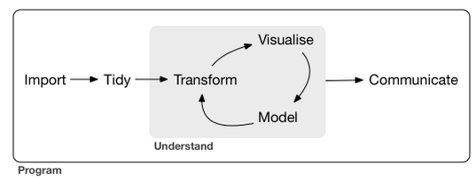

---
output:
  html_document
---

 

## R与数据科学

R是一门特立独行的语言。我接触过的编程语言有：C、Java、PHP、R、Python和Javascript。除了R，其他语言的入门标志可能是你学会用它的`if`和`for`完成了一套处理逻辑；但对R而言，入门标志恰恰是你小心谨慎地避免在R中使用`if`和`for`来完成处理逻辑。

R需要一种特殊的学习方法。学习其他的语言好比学理科，理解最重要，得会举一反三，基础扎实了，掌握新工具分分钟的事。学习R却好像念文科，背诵最重要，只要记住做某件事最顺手的包和函数，就能得心应手。

R是一门天生就适合数据科学的语言。数据科学最常见的数据规格是表格型数据，也称为矩形数据：每一行代表一个观测，每一列代表一个特征。R内置数据类型`data.frame`能够非常自然地表达这种数据。而这种内置带来的深远影响是几乎所有的R工具包都提供了对`data.frame`的支持，所以R在数据科学领域的生态体系是许多语言所不能匹敌的。

R社区需要感谢一家有情怀的公司**RStudio**，里面有许多大家耳熟能详的大神：创始人兼CEO J.J. Allaire；首席科学家Hadley Wickham；还有我们中国的高产R包作者谢益辉。

要入门R语言，最好的学习资料是[R for Data Science](http://r4ds.had.co.nz/index.html)，书里的这张插图很好地诠释了数据科学的工作内容，而R在这些内容上能够提供全套工具：

我依照这个结构把自己的R语言学习笔记整理放在下面，供感兴趣的朋友查阅。

### Import
- [读取文本](R_read_write_text.html)：**readr**
- [读取Excel](r_read_write_excel.html)：**readxl**, **xlsx**
- [读取MSQL](r_mysql.html)：**RMySQL**
- 网络请求：**httr**

### Transform
数据框通用操作：

- [**dplyr**](R_dplyr.html)：SQL操作算子体系1，如`filter`, `mutate`, `group_by`, `summarise`, `arrange`等
- [**tidyr**](r_tidyr.html)：宽长表转换，列拆分合并
- **data.table**：SQL操作算子体系2，dt[`where`, `select`, `group_by`]范式
- **splitstackshape**：基于**data.table**的列拆分宽长表转换

数据类型专题：

- [日期](R_datetime.html)：**lubridate**
- [字符串](R_string.html)：**stringr**
- [JSON](R_JSON.html)：**jsonlite**
- 列表：**rlist**

### Visualise

- [统计绘图](R_ggplot2.html)，内容待更新：**ggplot2**
- 统计绘图交互化：**plotly**
- 表格可视化：**DT**
- 时间序列处理与可视化：**zoo**，**xts**，**dygraphs**
- [空间数据处理与可视化](spatial_analysis_R_vis.html)：**sp**，**rgeos**，**rgdal**, **leaflet**

### Model

- [线性模型]：`lm`, `glm`
- [树模型]：`rpart`，`randomForest`，`gbm`
- [机器学习基础](ml_deep_mining_course_r.html)：线性回归、逻辑回归、梯度下降、牛顿法、正则化

### Communicate

- 静态文档：**rmarkdown**
- 交互式网站：**shiny**

### Big Data

- [HDFS](rhdfs_basic.html)，内容待更新：**rhdfs**
- MapReduce：rmr2
- [HBase](rhbase_basic.html)：**rhbase**
- [Spark](R_spark.html)：**SparkR**
- [阿里云ODPS](R_ODPS.html)：**RODPS**

### Applications

- [用shiny实现Excel数据透视图](R_shiny_ts_viewer.html)
- [R天池最后一公里](R_tianchi_logistics.html)

### Extend

- Javascript：**htmlwidgets**
- C++：**Rcpp**
- Java：**rJava**
- [R包开发](R_package_dev.html)，内容待更新：**devtools**，**roxygen2**

## 资料备份

**R工具箱**

+ [R工具箱01：Excel读写](r_read_write_excel.html)

**R数据分析系列**

+ [R数据分析进阶01：数据读取与处理](R_read_preprocess_old.html)
+ [R数据分析进阶02：日期时间处理-lubridate版](R_datetime.html)
+ [R数据分析进阶03：字符串处理](R_string.html)
+ [R数据分析进阶04：JSON处理](R_JSON.html)
+ [R数据分析进阶05：数据框打理-dplyr/tidyr版](R_dplyr_tidyr.html)
+ [R数据分析进阶06：统计绘图-ggplot2](R_ggplot2.html)
+ [R数据分析进阶07：分析交互化](R_interactive.html)
+ [R数据分析进阶08：空间可视化](spatial_analysis_R_vis.html)

**R作品**

+ [用shiny实现Excel数据透视图](R_shiny_ts_viewer.html)
+ [R包发布-线性回归为例](R_package_dev.html)
+ [R天池最后一公里](R_tianchi_logistics.html)
+ [吴恩达深度学习基础课程R版答案](ml_deep_mining_course_r.html)

**R与大数据**
+ [R使用阿里云ODPS](R_ODPS.html)
+ [R使用Spark](R_spark.html)
+ [R使用HDFS](rhdfs_basic.html)
+ [R使用HBase](rhbase_basic.html)

**R与Python对比**

+ [左手python右手R](left_python_right_r.html)

**RStudio Cheatsheet**

+ [ggplot2 cheatsheet](files/ggplot2-cheatsheet.pdf)
+ [rmarkdown cheatsheet](files/rmarkdown-cheatsheet-2.0.pdf)
+ [dplyr/tidyr cheatsheet](files/dplyr-tidyr-cheatsheet.pdf)
+ [shiny cheatsheet](files/shiny-cheatsheet.pdf)

不推荐使用的过期技术，仅供查阅。

+ [R数据分析进阶02：日期时间处理-POSIXct版](R_datetime_old.html)
+ [R数据分析进阶05(a)：数据框打理-plyr](R_plyr.html)
+ [R数据分析进阶05(b)：数据框打理-reshape2](R_reshape2.html)

