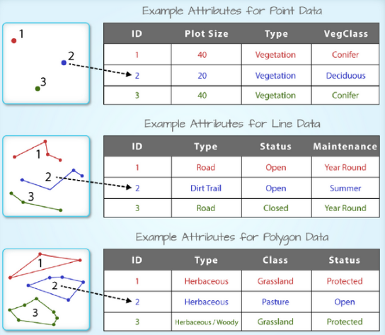

# 前言
很多朋友说在R里没法使用高德地图，这里给出一个基于leaflet包的解决方法。

``` {r, eval=F}
library(leaflet)

# 添加高德地图
m <- leaflet() %>%
  addTiles(
    'http://webrd02.is.autonavi.com/appmaptile?lang=zh_cn&size=1&scale=1&style=8&x={x}&y={y}&z={z}',
    tileOptions(tileSize=256, minZoom=9, maxZoom=17),
    attribution = '&copy; <a href="http://ditu.amap.com/">高德地图</a>',
  ) %>% 
  setView(116.40,39.90, zoom = 10)
m
```


当然，除了告诉大家怎么在R里调用高德地图外，本文还想做的深入一些，尝试对空间可视化的基础知识做一个简单的介绍。

# 空间数据基础知识
## shp文件
空间数据最常用的格式是shp，主要由三个文件组成：shp文件用于存储位置几何信息，dbf文件用于存储attribute，shx用于存储位置几何信息与attribute的对照表。位置几何信息主要有以下几类：points，multipoints，lines，polygons等。

## WKT与WKB
WKT(Well-known text)是开放地理空间联盟OGC（Open GIS Consortium ）制定的一种文本标记语言，用于表示矢量几何对象、空间参照系统及空间参照系统之间的转换。举例如下：
- 点（Point）："POINT(1 1)"
- 线（Line）："LINESTRING(0 0,1 1,2 2)"
- 多边形（Polygon）："POLYGON((0 0,3 0,3 3,0 3,0 0),(1 1,2 1,2 2,1 2,1 1))"

WKB(well-known binary) 是WKT的二进制表示形式，解决了WKT表达方式冗余的问题，便于传输和在数据库中存储相同的信息.

# R的空间数据处理与可视化

空间数据处理与可视化，需要解决三个问题，一是怎么在R中表示空间数据，二是怎么对空间对象进行计算；三是怎么在R中绘制空间数据/地图。sp用于解决第一个问题，rgeos用于解决第二个问题，leaflet用于解决第二个问题。

## sp
sp包的功能是在R中提供对象表示shp文件。SpatialPoints，SpatialMultiPoints，SpatialLines，SpatialPolygons等用于表示位置几何信息。attribute一般以表格形式存在，所以sp包用dataframe对齐进行表示。为前面提到的SpatialXXX添加dataframe后得到诸如SpatialPointsDataFrame，SpatialMutilPointsDataFrame，SpatialLinesDataFrame，SpatialPolygonsDataFrame等类。在这些类中，位置几何信息与attribute的对照关系通过Spatial类的ID与dataframe的rownames进行匹配得到。

SpatialXXDataFrame的结构示意图如下：




下面举一个例子，怎么从dataframe数据变为sp对象。

``` {r, eval=F}
library(splitstackshape)
library(sp)
library(dplyr)
library(tidyr)

# 自定义函数
points2spline <- function(df, id_field, lng_field, lat_field){
  df <- as.data.frame(df)
  data <- as.matrix(df[,c(lng_field, lat_field)])
  id = df[1, id_field]
  Lines(list(Line(data)), ID=id)
}

splines2splinesdf <- function(splines,  data, id_field)  {
  ids <- data.frame(names(splines))
  colnames(ids) <- id_field
  join_name <- dplyr::inner_join(ids, data)
  row.names(join_name ) <- join_name[, id_field]
  splinesdf <- SpatialLinesDataFrame(splines, data=join_name)
  proj4string(splinesdf ) <- CRS("+init=epsg:4326") # 设置投影坐标系，leaflet可以不用设置
  return(splinesdf)
}

# 准备数据
link_id <- c("road_one", "road_two")
coors <- c("116.44469451904297,39.890071868896484:116.44451141357422,39.891361236572266", "116.44499969482422,39.887630462646484:116.44469451904297,39.890071868896484")
status <- c("congest", "uncongest")

link_coors <- data.frame(link_id, coors, status)
lon_lat_df <- cSplit(link_coors %>% select(link_id, coors), 
       c("coors"), sep=":", direction="long") %>% 
  separate(coors, c("lng", "lat"),  sep=",", convert=TRUE)

# data.frame转化为sp
link_list <- split(lon_lat_df, lon_lat_df$link_id)
names(link_list) <- NULL
Sl <- SpatialLines(plyr::llply(link_list, points2spline, "link_id", "lng", "lat"))
Sldf <- splines2splinesdf(Sl, link_coors, "link_id")

str(Sldf)
```

## rgeos
空间处理，主要用来做一些空间运算，比如计算两个空间对象的位置关系：相交，重叠，包含等等。再比如，根据空间对象创建新的空间对象。此外，rgeos还能够完成WKT与sp对象的相互转换。

``` {r, eval=F}
library(rgeos)

# 创建外扩与内缩buffer，演示WKT的读写
dilated_buffer <- gBuffer(Sldf, byid=TRUE, width=0.0002, capStyle="FLAT")
dilated_buffer_wkt <- readWKT(writeWKT(dilated_buffer, byid = FALSE))
eroded_buffer <- gBuffer(dilated_buffer, byid=TRUE, width=-0.0001, capStyle="SQUARE")
```

## leaflet
我们继续上面的例子，将空间对象绘制到高德地图上。

``` {r, eval=F}
library(leaflet)
factpal <- colorFactor(c(rgb(1,0,0,1),rgb(0, 1, 0, 1)), domain=c("congest", "uncongest"))

m <- leaflet() %>%
  addTiles(
    'http://webrd02.is.autonavi.com/appmaptile?lang=zh_cn&size=1&scale=1&style=8&x={x}&y={y}&z={z}',
    tileOptions(tileSize=256, minZoom=9, maxZoom=17),
    attribution = '&copy; <a href="http://ditu.amap.com/">高德地图</a>',
    group="高德地图"
  ) %>%
  setView(116.40,39.90, zoom = 10)  %>%
  addPolylines(color=~factpal(status), weight=3,opacity=1,  data=Sldf, group="实时路况") %>%
  addPolygons(data=dilated_buffer_wkt, group="空间计算") %>% 
  addPolygons(data=eroded_buffer, color="black", group="空间计算") %>%
  addLayersControl(
    overlayGroups = c("高德地图", "实时路况", "空间计算"),
    options = layersControlOptions(collapsed = FALSE)
  ) %>%
  addLegend("bottomleft", pal = factpal, values = Sldf@data$status,
            title = "实时交通", 
            opacity = 1
  ) %>%
  fitBounds(Sldf@bbox["x", "min"] - 0.001, Sldf@bbox["y", "min"] - 0.001, 
            Sldf@bbox["x", "max"] + 0.001, Sldf@bbox["y", "max"] + 0.001
  )

m
```


