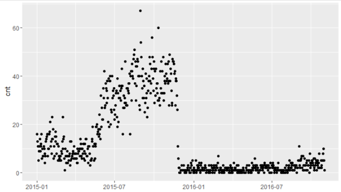

# 背景
我们对一条道路的每一天有一个通车数的观测值。举一条虚拟的比较偏僻的道路为例，它从2015年1月至今的通车数曲线如下图所示：



从上图可以看出，正常情况下这条路的每日通车数在三四十，2015年11月底应该是进行了封闭施工修路，导致通车数骤然减少，且这种修路的状况一直持续至今。这条路是某些起终点的捷径，因为修路，一年以来，一些用户不得不绕道行车，浪费了不少时间。现在，我们很关心什么时候这条路施工结束恢复通车，这样可以让这些用户节省不少出行时间。

我们将每个月每天的通车数观测值存为了一个json字符串。每个月的json字符串用#进行拼接，得到如下的输入字符串：

``` {python, eval=F}
link_content = '''
{"20151001":46,"20151002":29,"20151003":42,"20151004":32,"20151005":43,"20151006":35,"20151007":37,"20151008":37,"20151009":33,"20151010":30,"20151011":60,"20151012":30,"20151013":31,"20151014":28,"20151015":42,"20151016":35,"20151017":33,"20151018":46,"20151019":33,"20151020":42,"20151021":33,"20151022":48,"20151023":30,"20151024":33,"20151025":38,"20151026":40,"20151027":37,"20151028":45,"20151029":41,"20151030":38,"20151031":39}#{"20150101":16,"20150102":13,"20150103":13,"20150104":11,"20150105":5,"20150106":9,"20150107":11,"20150108":14,"20150109":9,"20150110":11,"20150111":12,"20150112":16,"20150113":6,"20150114":10,"20150115":7,"20150116":7,"20150117":11,"20150118":10,"20150119":8,"20150120":4,"20150121":7,"20150122":13,"20150123":14,"20150124":15,"20150125":16,"20150126":7,"20150127":10,"20150128":16,"20150129":10,"20150130":16,"20150131":17}#{"20160901":5,"20160902":11,"20160903":3,"20160904":5,"20160905":2,"20160906":5,"20160907":6,"20160908":7,"20160909":2,"20160910":7,"20160911":1,"20160912":7,"20160913":3,"20160914":1,"20160915":6,"20160916":3,"20160917":3,"20160918":1,"20160919":4,"20160920":5,"20160921":5,"20160922":1,"20160923":3,"20160924":3,"20160925":5,"20160927":8,"20160928":2,"20160929":4,"20160930":3}#{"20150601":27,"20150602":22,"20150603":22,"20150604":22,"20150605":35,"20150606":31,"20150607":42,"20150608":27,"20150609":28,"20150610":37,"20150611":35,"20150612":29,"20150613":34,"20150614":38,"20150615":31,"20150616":21,"20150617":39,"20150618":19,"20150619":38,"20150620":38,"20150621":40,"20150622":20,"20150623":26,"20150624":25,"20150625":40,"20150626":31,"20150627":34,"20150628":32,"20150629":26,"20150630":35}#{"20161001":4,"20161002":5,"20161003":5,"20161004":4,"20161005":3,"20161006":6,"20161007":2,"20161008":1,"20161009":6,"20161010":3,"20161011":4,"20161012":5,"20161013":1,"20161014":4,"20161015":3,"20161016":5,"20161017":2,"20161018":4,"20161019":8,"20161020":2,"20161021":2,"20161022":2,"20161023":5,"20161024":3,"20161025":2,"20161026":5,"20161027":5,"20161028":8,"20161029":10,"20161030":5,"20161031":1}#{"20150701":22,"20150702":24,"20150703":28,"20150704":33,"20150705":34,"20150706":23,"20150707":39,"20150708":19,"20150709":33,"20150710":21,"20150711":31,"20150712":36,"20150713":31,"20150714":34,"20150715":30,"20150716":36,"20150717":35,"20150718":43,"20150719":36,"20150720":16,"20150721":27,"20150722":32,"20150723":27,"20150724":29,"20150725":31,"20150726":46,"20150727":29,"20150728":28,"20150729":35,"20150730":28,"20150731":35}#{"20160201":1,"20160202":1,"20160203":1,"20160206":3,"20160207":1,"20160209":1,"20160210":3,"20160211":3,"20160212":2,"20160213":2,"20160215":1,"20160216":2,"20160217":3,"20160219":2,"20160220":1,"20160221":1,"20160222":3,"20160223":3,"20160224":2,"20160225":2,"20160226":4,"20160227":7,"20160228":1}#{"20150201":21,"20150202":11,"20150203":13,"20150204":8,"20150205":23,"20150206":14,"20150207":14,"20150208":18,"20150209":6,"20150210":11,"20150211":7,"20150212":15,"20150213":17,"20150214":13,"20150215":15,"20150216":8,"20150217":12,"20150218":12,"20150219":5,"20150220":11,"20150221":7,"20150222":6,"20150223":5,"20150224":7,"20150225":7,"20150226":5,"20150227":9,"20150228":8}#{"20160301":1,"20160302":1,"20160303":2,"20160304":2,"20160305":1,"20160307":1,"20160309":1,"20160310":3,"20160313":1,"20160314":2,"20160315":2,"20160316":2,"20160317":2,"20160318":1,"20160319":1,"20160320":1,"20160321":2,"20160322":2,"20160324":1,"20160326":2,"20160327":3,"20160329":1,"20160330":2}#{"20150801":34,"20150802":37,"20150803":33,"20150804":37,"20150805":41,"20150806":16,"20150807":40,"20150808":42,"20150809":30,"20150810":42,"20150811":45,"20150812":40,"20150813":39,"20150814":47,"20150815":49,"20150816":51,"20150817":37,"20150818":46,"20150819":30,"20150820":44,"20150821":36,"20150822":44,"20150823":47,"20150824":46,"20150825":40,"20150826":40,"20150827":28,"20150828":40,"20150829":26,"20150830":67,"20150831":54}#{"20150401":6,"20150402":8,"20150403":6,"20150404":4,"20150405":4,"20150406":10,"20150407":8,"20150408":9,"20150409":9,"20150410":10,"20150411":7,"20150412":14,"20150413":12,"20150414":10,"20150415":7,"20150416":6,"20150417":10,"20150418":8,"20150419":12,"20150420":6,"20150421":9,"20150422":5,"20150423":12,"20150424":8,"20150425":14,"20150426":14,"20150427":7,"20150428":7,"20150429":10,"20150430":4}#{"20160101":2,"20160102":1,"20160104":1,"20160105":1,"20160106":5,"20160108":1,"20160109":3,"20160110":2,"20160111":1,"20160112":3,"20160113":2,"20160114":4,"20160115":1,"20160117":3,"20160118":1,"20160119":4,"20160120":1,"20160121":2,"20160122":2,"20160123":1,"20160124":1,"20160125":1,"20160126":2,"20160127":2,"20160128":3,"20160129":2,"20160131":1}#{"20150301":13,"20150302":10,"20150303":23,"20150304":14,"20150305":15,"20150306":6,"20150307":1,"20150308":10,"20150309":7,"20150310":4,"20150311":7,"20150312":7,"20150313":9,"20150314":4,"20150315":7,"20150316":5,"20150317":7,"20150318":8,"20150319":3,"20150320":13,"20150321":5,"20150322":13,"20150323":6,"20150324":7,"20150325":8,"20150326":9,"20150327":6,"20150328":11,"20150329":8,"20150330":6,"20150331":8}#{"20160502":2,"20160503":1,"20160504":3,"20160505":1,"20160506":1,"20160508":1,"20160509":3,"20160510":1,"20160511":1,"20160513":1,"20160515":4,"20160516":1,"20160517":2,"20160518":1,"20160519":3,"20160520":2,"20160521":2,"20160522":6,"20160523":3,"20160524":1,"20160525":2,"20160526":3,"20160527":3,"20160528":1,"20160529":2}#{"20160601":1,"20160602":1,"20160603":1,"20160604":1,"20160605":3,"20160606":2,"20160607":2,"20160608":3,"20160609":1,"20160610":3,"20160611":2,"20160612":3,"20160614":4,"20160615":3,"20160616":2,"20160617":3,"20160618":3,"20160619":2,"20160620":3,"20160621":3,"20160622":1,"20160623":3,"20160624":2,"20160626":2,"20160627":4}#{"20160401":1,"20160402":1,"20160403":4,"20160404":1,"20160405":1,"20160406":2,"20160407":2,"20160408":1,"20160409":1,"20160410":3,"20160412":1,"20160414":3,"20160416":1,"20160417":1,"20160419":1,"20160420":1,"20160422":1,"20160424":1,"20160425":2,"20160426":1}#{"20151202":1,"20151203":1,"20151204":3,"20151205":1,"20151206":1,"20151207":1,"20151208":1,"20151209":3,"20151210":1,"20151212":1,"20151213":1,"20151215":1,"20151216":1,"20151217":1,"20151218":2,"20151219":3,"20151220":1,"20151221":1,"20151223":2,"20151225":2,"20151226":4,"20151227":3,"20151228":1,"20151229":5,"20151230":1}#{"20151101":45,"20151102":37,"20151103":38,"20151104":46,"20151105":28,"20151106":49,"20151107":38,"20151108":43,"20151109":41,"20151110":34,"20151111":29,"20151112":28,"20151113":47,"20151114":46,"20151115":46,"20151116":45,"20151117":41,"20151118":42,"20151119":28,"20151120":38,"20151121":39,"20151122":38,"20151123":32,"20151124":26,"20151125":11,"20151126":6,"20151127":2,"20151129":2}#{"20160801":2,"20160803":1,"20160804":3,"20160805":1,"20160807":1,"20160808":1,"20160809":2,"20160810":3,"20160811":5,"20160812":1,"20160813":2,"20160814":4,"20160815":2,"20160816":3,"20160817":1,"20160818":4,"20160819":1,"20160820":1,"20160821":3,"20160822":1,"20160823":3,"20160824":2,"20160825":3,"20160826":3,"20160827":3,"20160829":2,"20160830":2,"20160831":5}#{"20150501":11,"20150502":11,"20150503":11,"20150504":8,"20150505":3,"20150506":5,"20150507":5,"20150508":6,"20150509":13,"20150510":14,"20150511":19,"20150512":11,"20150513":11,"20150514":5,"20150515":12,"20150516":6,"20150517":12,"20150518":11,"20150519":19,"20150520":19,"20150521":20,"20150522":16,"20150523":17,"20150524":18,"20150525":15,"20150526":24,"20150527":16,"20150528":18,"20150529":14,"20150530":32,"20150531":19}#{"20160701":3,"20160702":2,"20160703":4,"20160704":3,"20160705":2,"20160706":1,"20160708":1,"20160709":2,"20160710":2,"20160711":1,"20160713":1,"20160714":2,"20160715":1,"20160716":4,"20160717":1,"20160718":1,"20160719":1,"20160720":1,"20160721":1,"20160722":1,"20160724":1,"20160726":1,"20160728":1}#{"20150901":48,"20150902":40,"20150903":35,"20150904":31,"20150905":43,"20150906":38,"20150907":31,"20150908":36,"20150909":25,"20150910":29,"20150911":41,"20150912":31,"20150913":33,"20150914":39,"20150915":23,"20150916":27,"20150917":34,"20150918":38,"20150919":40,"20150920":48,"20150921":45,"20150922":38,"20150923":33,"20150924":37,"20150925":43,"20150926":56,"20150927":48,"20150928":39,"20150929":34,"20150930":43}
'''
```

我们希望根据上面的输入获得这条路正常状态下的通车数参照值，以便我们判断什么时候修路结束。为此，我们需要设计一套简明的规则，识别这组观测中连续多天处于异常低点的日期。


# 问题拆解
## 解析字符串
首先，我们将输入字符串转化为python的dict。这里面的一个需要记住的技巧是***如何将多个dict合并为一个dict**：

``` {python, eval=F}
import json

def parse_link_content(link_content, sep = "#"):
    ret_dict = {}
    dt_content = link_content.strip().split(sep)
    for item in dt_content:
        dt_dict = json.loads(item)
        ret_dict.update(dt_dict) # 将多个dict合并为一个dict
    return ret_dict

link_dict = parse_link_content(link_content)
```

## 填充缺失值
为了节省存储空间，如果一条道路某一天没有通车，这一天的观测值是缺失的。本文的例子缺失值较少，只有几十天。真实世界中，有不少道路大部分时候是没有通车的，因此需要填补缺失值，才能在数据层面上对道路的通车情况进行描述，也便于可视化作图。为了填充缺失的那几天的观测值，我们首先要解决**如何对dict的内容按照key排序**。

``` {python, eval=F}
sort_list = sorted(link_dict.items(), key=lambda d: d[0]) # 对dict的内容按照key排序
```

接下来，我们来填充缺失那些天的数据。

``` {python, eval=F}
import datetime

def fill_missing(sort_list):
    ret_list = []
    pred_dt = None
    for item in sort_list:
        dt = datetime.datetime.strptime(item[0], "%Y%m%d")
        if pred_dt == None:
            ret_list.append(item)
            pred_dt = dt
        else:
            fill_size = (dt - pred_dt).days - 1
            for i in range(fill_size):
                fill_dt = pred_dt + datetime.timedelta(days=(i+1))
                ret_list.append((datetime.datetime.strftime(fill_dt, "%Y%m%d"), 0))
            ret_list.append(item)
            pred_dt = dt
    return ret_list

fill_list = fill_missing(sort_list)
```

## 获取参照值
道路每天的通车数正常状况下是比较平稳的。为了排除封路的影响，我们想取出95分位的通车数`ref_cnt`作为正常通车数的基本参照。**对一个list进行分位数计算**，最便捷的方法是使用numpy库。

``` {python, eval=F}
import numpy as np

def strip_tm(fill_list):
    return [d[1] for d in fill_list]

def get_percentile(strip_list, percentile):
    np_list = np.array(strip_list)
    return np.percentile(np_list, percentile) # 分位数计算
    
ref_cnt = get_percentile(strip_tm(fill_list), 95)
```

封路的判别实际上是比较有难度的。其中一个困难是，封路的时候通车数并不为0，这个与我们的直觉是相悖的。这个现象的原因有很多，可能是工程车辆、行人或自行车开着导航进入这条道路提供的通车数；可能是这条道路的一半处于封闭状态，大量轨迹在中间掉头；可能是旁边有一条临近的平行道路，GPS点的定位精度不够，有些点漂到了这条封闭的道路上，让我们误以为这条道路上仍有通车。为此，我们只能通过设定阈值来判定是否封路，而不能根据流量是否为0来判断。

根据经验和观察，我们设计以下简单的策略来获取状态变迁的日期：以`0.1 * ref_cnt`为封路参照值`close_ref_cnt`，以`0.5 * ref_cnt`为开通参照值`open_ref_cnt`。我们设计的简单策略是：连续三天的通车数低于`close_ref_cnt`，报封路；连续三天的通车数高于`open_ref_cnt`时报开通。

``` {python, eval=F}
def simple_close_judge(fill_list, close_ref_value, open_ref_value):
    cum_close_cnt = 0
    cum_open_cnt = 0
    state = 0
    for i, item in enumerate(fill_list):
        tm, cnt = item
        if state == 0:
            if cnt < close_ref_value:
                cum_close_cnt += 1
            elif cnt >= close_ref_value:
                cum_close_cnt = 0
            if cum_close_cnt >= 3:
                state = 1
                cum_open_cnt = 0
                print fill_list[i-2][0] + ' close'
        elif state == 1:
            if cnt >= open_ref_value:
                cum_open_cnt += 1
            elif cnt < open_ref_value:
                cum_open_cnt = 0
            if cum_open_cnt >= 3:
                state = 0
                cum_close_cnt = 0
                print fill_list[i-2][0] + 'open'

close_ref_cnt = ref_cnt * 0.1
open_ref_cnt = ref_cnt * 0.5
simple_close_judge(fill_list, close_ref_cnt, open_ref_cnt)
```

就这个例子，我们的程序会检测到2015-11-27日为封路开始日期，之前为道路开通状态，之后为封闭状态，封闭状态持续至2016-10-31。所以我们可以基于2015-01-01至2015-11-27的历史数据统计出道路开通状态的通车数参照值，当这条路的通车数再次达到这个水平时，说明开通了。

# 小结
* 业务
1. 道路通车数：空间分析重要的数据资产，基于它可以做很多有关道路状态的判别业务，新增、开通、封路、施工等；
2. 通车数的可信度：封路时通车数流量不为0，原因有很多；能否设计出高效的通车数置信度算法，是提高通车数数据分析业务准确率的关键。

* 技术
1. python多个dict合并为1个dict；
2. python字典按照key或者value进行排序；
3. numpy计算分位数
